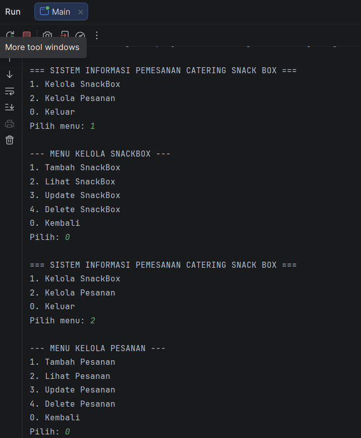
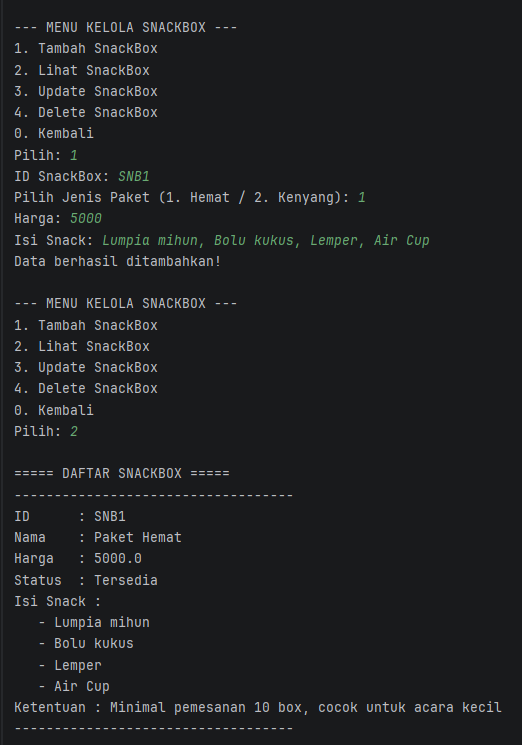
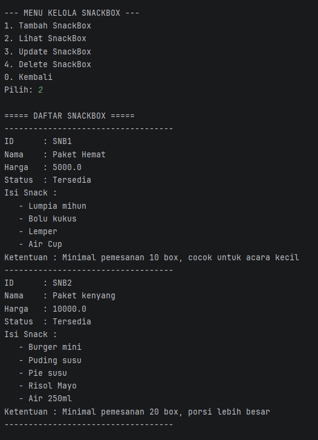
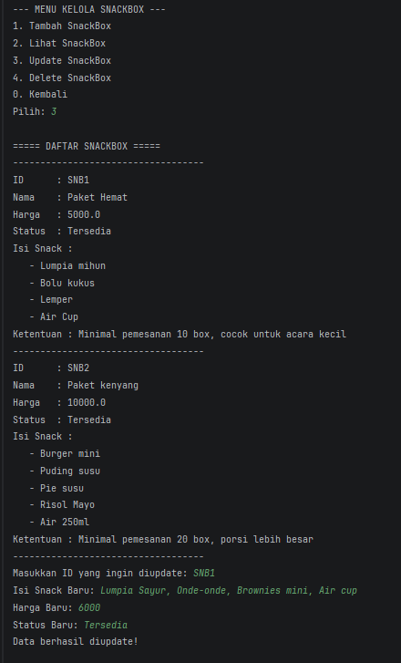
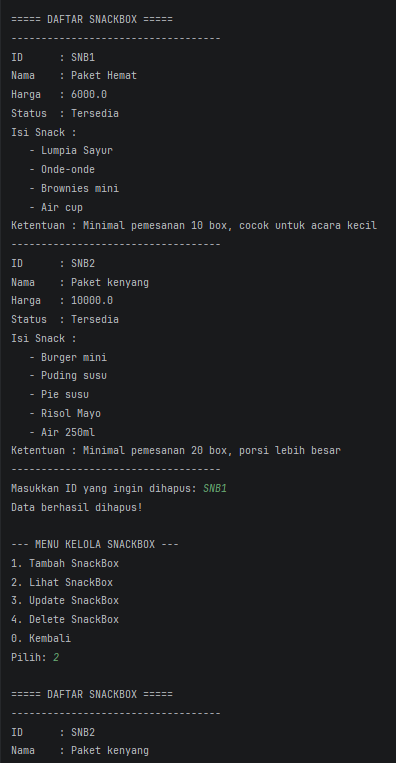
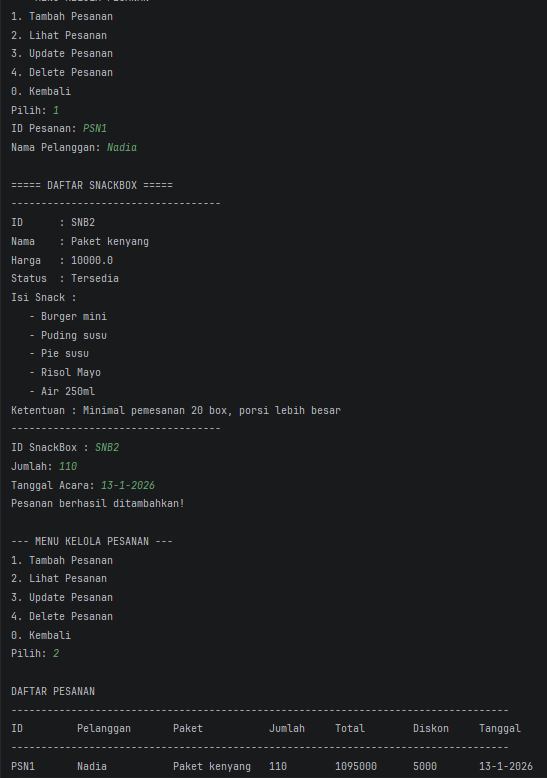
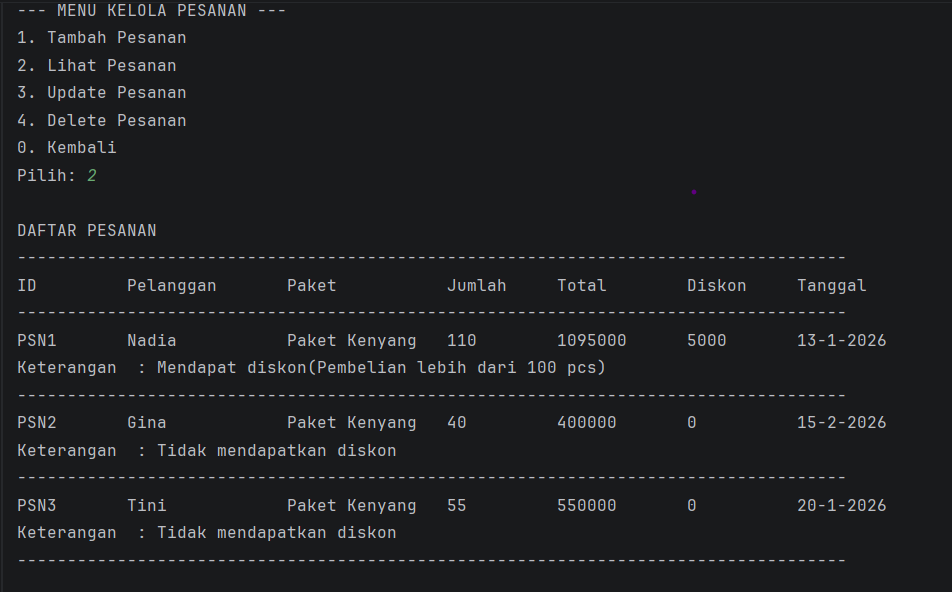
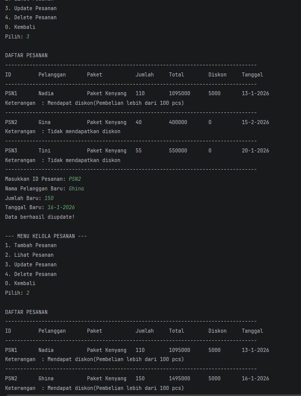
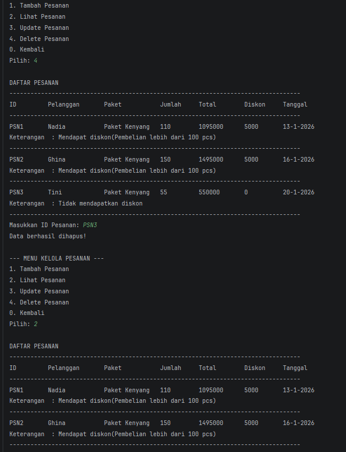

# Sistem Informasi Pemesanan Catering Snack Box

## Identitas

**Nama:** Nadia Rahmah  
**NIM:** 2409106018  
**Mata Kuliah:** Pemrograman Berorientasi Objek  
**Tugas:** Posttest 5

---

## 1. Deskripsi Program

Program ini berjudul **Sistem Informasi Pemesanan Catering Snack Box** berbasis Java Console yang dibuat menggunakan konsep Object Oriented Programming (OOP).

Program ini digunakan untuk mengelola data paket snack box dan data pesanan pelanggan. Sistem memungkinkan pengguna untuk melakukan operasi CRUD (Create, Read, Update, Delete)** terhadap data yang disimpan dalam ArrayList.

Program memiliki menu yang akan terus berjalan hingga pengguna memilih opsi **Kembali**.

Class yang digunakan dalam program ini adalah:

1. **SnackBox**(Abstract class)
2. **Pesanan**(Implementation Interface)
3. **PaketHemat**(Inheritance dari SnackBox)
4. **PaketKenyang**(Inheritance dari SnackBox)
5. **Diskon** (Interface)
6. **Main (program utama)**

---

## 2. Penjelasan Alur dan Algoritma Program

Berikut alur dan algoritma program:

1. Program dijalankan dan menampilkan **menu utama**.
2. Pengguna memilih menu:
    - Kelola SnackBox
    - Kelola Pesanan
    - Keluar Program
3. Jika pengguna memilih **Kelola SnackBox**, maka akan muncul submenu:
    - Tambah SnackBox
    - Lihat Daftar SnackBox
    - Update SnackBox
    - Hapus SnackBox
    - Kembali
4. Jika pengguna memilih **Kelola Pesanan**, maka akan muncul submenu:
    - Tambah Pesanan
    - Lihat Daftar Pesanan
    - Update Pesanan
    - Hapus Pesanan
    - Kembali
5. Program menggunakan **ArrayList** untuk menyimpan data objek SnackBox dan Pesanan.
6. Pada proses **Update dan Delete**, program akan menampilkan data terlebih dahulu menggunakan method **Read** agar pengguna dapat melihat daftar data yang tersedia.
7. Program akan melakukan **validasi input menggunakan percabangan `if`**, seperti:
    - Mengecek apakah input kosong
    - Mengecek apakah data tersedia
8. Program akan terus berjalan sampai pengguna memilih **Keluar**.
9. Program menerapkan Encapsulation dengan Getter dan Setter serta menggunakan beberapa Access Modifier yaitu:
    - public
    - private
    - protected
10. Program menerapkan Inheritance tipe Hierarchical Inheritance karena superclass diwarisi oleh lebih dari satu subclass.
    - Menjadikan SnackBox sebagai Superclass yang memiliki dua subclass yaitu class PaketHemat dan class PaketKenyang.
11. Program menerapkan Polymorphism yang dilakukan dengan cara:
    - Penggunaan Method Overloading
    - Penggunaan Method Overriding
12. Program menerapkan Abstraction dan Interface
    - Abstraction:
        - Menjadikan class SnackBox menjadi abstract class
        - Memiliki abstract method getKetentuan() yang wajib diimplementasikan oleh subclass
        - Tidak dapat diinstansiasi secara langsung
    - Interface:
        - Menggunakan Interface Diskon
        - Memiliki method hitungDiskon() untuk menghitung diskon
        - Memiliki method infoDiskon() untukmemberikan informasi kondisi diskon
        - Class pesanan mengimplementasikan interface tersebut
---

## 3. Fitur Program

Program memiliki beberapa fitur utama yaitu:

### 1. Kelola SnackBox

- Menambah data paket snack
- Menampilkan daftar paket snack
- Mengupdate data paket snack
- Menghapus data paket snack

### 2. Kelola Pesanan

- Menambah data pesanan
- Menampilkan daftar pesanan
- Mengupdate data pesanan
- Menghapus data pesanan

### 3. Validasi Input

Program melakukan pengecekan menggunakan **percabangan `if`**, seperti:

- Input tidak boleh kosong
- Data harus tersedia sebelum diupdate atau dihapus

### 4. Program Berjalan Berulang

Program menggunakan **perulangan** sehingga menu akan terus muncul sampai pengguna memilih **Keluar**.

### 5. Penerapan Encapsulation

Penerapan Encaptulation pada program dilakukan dengan cara:
1. Mengubah atribut pada class menjadi private
2. Mengakses atribut menggunakan Getter dan Setter
3. Mengatur hak akses menggunakan access modifier
---
### 6. Penerapan Inheritance

Penerapan Inheritance pada program dilakukan dengan cara:
1. Menjadikan Class Snackbox sebagai Superclass/ Parent Class
2. Membuat 2 Subclass baru, yaitu Class PaketHemat dan Class PaketKenyang
3. Tipe Inheritance yang diterapkan adalah tipe Hierarchical Inheritance karena superclass diwarisi oleh lebih dari satu subclass

### 6. Penerapan Polymorphism

Penerapan Polymorphism pada program dilakukan dengan cara:
1. Penggunaan Method Overloading pada method hitungTotal untuk membedakan pemberian diskon 5000 dengan kondisi pesanan berjumlah lebih dari 100 box
2. Penggunaan Method Overriding pada method ketentuan untuk membedakan ketentuan jenis namaPaket

### 7. Penerapan Abstract dan Interface
Penerapan Abstraction pada program dilakukan dengan cara:
1. Mengubah class SnackBox menjadi Abstract Class
2. Memuat Abstract Method getKetentuan()
3. Method getKetentuan wajib diimplementasikan oleh subclass(PaketHemat dan PaketKenyang)
4. Class abstract tidak dapat diintansiasi secara langsung
Penerapan Interface pada program dilakukan dengan cara:
1. Membuat Interface bernama Diskon
2. Interface memiliki method:
    - hitungDiskon()
    - infoDiskon()
3. Class Pesanan mengimlementaiskan interface Diskon. Digunakan untuk:
    - Menghitung diskon berdaarkan jumlah pesanan
    - Menampilkan informasi apakah pesanan mendapat diskon atau tidak
## 4. Output Program

Berikut adalah tampilan output program.

### Menu Utama

---

### Tambah Data SnackBox

---

### Daftar SnackBox

---

### Update SnackBox

---

### Hapus SnackBox

---

### Tambah Pesanan

---

### Daftar Pesanan

---

### Update Pesanan

---

### Hapus Pesanan

---

## Kesimpulan

Program ini menerapkan konsep **Object Oriented Programming (OOP)** menggunakan bahasa pemrograman **Java** dengan memanfaatkan **class, object, dan ArrayList** untuk mengelola data.

Melalui program ini. Pada program juga menerapkan konsep Encapculation, Inheritance dan Polimorphism. Pengguna dapat mengelola data **snack box** dan **pesanan** secara sederhana melalui menu berbasis console.

---